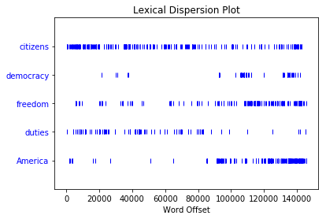
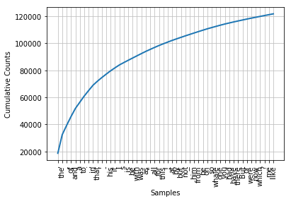

```python
from nltk.book import *
```


```python
text1
```


```python
text2
```


    <Text: Sense and Sensibility by Jane Austen 1811>


```python
text1.concordance("monstrous")
```

    Displaying 11 of 11 matches:
    ong the former , one was of a most monstrous size . ... This came towards us , 
    ON OF THE PSALMS . " Touching that monstrous bulk of the whale or ork we have r
    ll over with a heathenish array of monstrous clubs and spears . Some were thick
    d as you gazed , and wondered what monstrous cannibal and savage could ever hav
    that has survived the flood ; most monstrous and most mountainous ! That Himmal
    they might scout at Moby Dick as a monstrous fable , or still worse and more de
    th of Radney .'" CHAPTER 55 Of the Monstrous Pictures of Whales . I shall ere l
    ing Scenes . In connexion with the monstrous pictures of whales , I am strongly
    ere to enter upon those still more monstrous stories of them which are to be fo
    ght have been rummaged out of this monstrous cabinet there is no telling . But 
    of Whale - Bones ; for Whales of a monstrous size are oftentimes cast up dead u
    


```python
text1.similar("monstrous")
```

    imperial subtly impalpable pitiable curious abundant perilous
    trustworthy untoward singular lamentable few determined maddens
    horrible tyrannical lazy mystifying christian exasperate
    


```python
text2.similar("monstrous")
```

    very exceedingly so heartily a great good amazingly as sweet
    remarkably extremely vast
    


```python
text2.common_contexts(["monstrous", "very"])
```

    a_pretty is_pretty a_lucky am_glad be_glad
    


```python
text4.dispersion_plot(["citizens", "democracy", "freedom", "duties", "America"])
```





```python
text3.generate()
```


    ---------------------------------------------------------------------------

    TypeError                                 Traceback (most recent call last)

    <ipython-input-17-e0816ba18b61> in <module>()
    ----> 1 text3.generate()
    

    TypeError: generate() takes exactly 2 arguments (1 given)


```python
len(text3)
```


    44764


```python
sorted(set(text3))
```


    [u'!',
     u"'",
     u'(',
     u')',
     u',',
     u',)',
     u'.',
     u'.)',
     u':',
     u';',
     u';)',
     u'?',
     u'?)',
     u'A',
     u'Abel',
     u'Abelmizraim',
     u'Abidah',
     u'Abide',
     u'Abimael',
     u'Abimelech',
     u'Abr',
     u'Abrah',
     u'Abraham',
     u'Abram',
     u'Accad',
     u'Achbor',
     u'Adah',
     u'Adam',
     u'Adbeel',
     u'Admah',
     u'Adullamite',
     u'After',
     u'Aholibamah',
     u'Ahuzzath',
     u'Ajah',
     u'Akan',
     u'All',
     u'Allonbachuth',
     u'Almighty',
     u'Almodad',
     u'Also',
     u'Alvah',
     u'Alvan',
     u'Am',
     u'Amal',
     u'Amalek',
     u'Amalekites',
     u'Ammon',
     u'Amorite',
     u'Amorites',
     u'Amraphel',
     u'An',
     u'Anah',
     u'Anamim',
     u'And',
     u'Aner',
     u'Angel',
     u'Appoint',
     u'Aram',
     u'Aran',
     u'Ararat',
     u'Arbah',
     u'Ard',
     u'Are',
     u'Areli',
     u'Arioch',
     u'Arise',
     u'Arkite',
     u'Arodi',
     u'Arphaxad',
     u'Art',
     u'Arvadite',
     u'As',
     u'Asenath',
     u'Ashbel',
     u'Asher',
     u'Ashkenaz',
     u'Ashteroth',
     u'Ask',
     u'Asshur',
     u'Asshurim',
     u'Assyr',
     u'Assyria',
     u'At',
     u'Atad',
     u'Avith',
     u'Baalhanan',
     u'Babel',
     u'Bashemath',
     u'Be',
     u'Because',
     u'Becher',
     u'Bedad',
     u'Beeri',
     u'Beerlahairoi',
     u'Beersheba',
     u'Behold',
     u'Bela',
     u'Belah',
     u'Benam',
     u'Benjamin',
     u'Beno',
     u'Beor',
     u'Bera',
     u'Bered',
     u'Beriah',
     u'Bethel',
     u'Bethlehem',
     u'Bethuel',
     u'Beware',
     u'Bilhah',
     u'Bilhan',
     u'Binding',
     u'Birsha',
     u'Bless',
     u'Blessed',
     u'Both',
     u'Bow',
     u'Bozrah',
     u'Bring',
     u'But',
     u'Buz',
     u'By',
     u'Cain',
     u'Cainan',
     u'Calah',
     u'Calneh',
     u'Can',
     u'Cana',
     u'Canaan',
     u'Canaanite',
     u'Canaanites',
     u'Canaanitish',
     u'Caphtorim',
     u'Carmi',
     u'Casluhim',
     u'Cast',
     u'Cause',
     u'Chaldees',
     u'Chedorlaomer',
     u'Cheran',
     u'Cherubims',
     u'Chesed',
     u'Chezib',
     u'Come',
     u'Cursed',
     u'Cush',
     u'Damascus',
     u'Dan',
     u'Day',
     u'Deborah',
     u'Dedan',
     u'Deliver',
     u'Diklah',
     u'Din',
     u'Dinah',
     u'Dinhabah',
     u'Discern',
     u'Dishan',
     u'Dishon',
     u'Do',
     u'Dodanim',
     u'Dothan',
     u'Drink',
     u'Duke',
     u'Dumah',
     u'Earth',
     u'Ebal',
     u'Eber',
     u'Edar',
     u'Eden',
     u'Edom',
     u'Edomites',
     u'Egy',
     u'Egypt',
     u'Egyptia',
     u'Egyptian',
     u'Egyptians',
     u'Ehi',
     u'Elah',
     u'Elam',
     u'Elbethel',
     u'Eldaah',
     u'EleloheIsrael',
     u'Eliezer',
     u'Eliphaz',
     u'Elishah',
     u'Ellasar',
     u'Elon',
     u'Elparan',
     u'Emins',
     u'En',
     u'Enmishpat',
     u'Eno',
     u'Enoch',
     u'Enos',
     u'Ephah',
     u'Epher',
     u'Ephra',
     u'Ephraim',
     u'Ephrath',
     u'Ephron',
     u'Er',
     u'Erech',
     u'Eri',
     u'Es',
     u'Esau',
     u'Escape',
     u'Esek',
     u'Eshban',
     u'Eshcol',
     u'Ethiopia',
     u'Euphrat',
     u'Euphrates',
     u'Eve',
     u'Even',
     u'Every',
     u'Except',
     u'Ezbon',
     u'Ezer',
     u'Fear',
     u'Feed',
     u'Fifteen',
     u'Fill',
     u'For',
     u'Forasmuch',
     u'Forgive',
     u'From',
     u'Fulfil',
     u'G',
     u'Gad',
     u'Gaham',
     u'Galeed',
     u'Gatam',
     u'Gather',
     u'Gaza',
     u'Gentiles',
     u'Gera',
     u'Gerar',
     u'Gershon',
     u'Get',
     u'Gether',
     u'Gihon',
     u'Gilead',
     u'Girgashites',
     u'Girgasite',
     u'Give',
     u'Go',
     u'God',
     u'Gomer',
     u'Gomorrah',
     u'Goshen',
     u'Guni',
     u'Hadad',
     u'Hadar',
     u'Hadoram',
     u'Hagar',
     u'Haggi',
     u'Hai',
     u'Ham',
     u'Hamathite',
     u'Hamor',
     u'Hamul',
     u'Hanoch',
     u'Happy',
     u'Haran',
     u'Hast',
     u'Haste',
     u'Have',
     u'Havilah',
     u'Hazarmaveth',
     u'Hazezontamar',
     u'Hazo',
     u'He',
     u'Hear',
     u'Heaven',
     u'Heber',
     u'Hebrew',
     u'Hebrews',
     u'Hebron',
     u'Hemam',
     u'Hemdan',
     u'Here',
     u'Hereby',
     u'Heth',
     u'Hezron',
     u'Hiddekel',
     u'Hinder',
     u'Hirah',
     u'His',
     u'Hitti',
     u'Hittite',
     u'Hittites',
     u'Hivite',
     u'Hobah',
     u'Hori',
     u'Horite',
     u'Horites',
     u'How',
     u'Hul',
     u'Huppim',
     u'Husham',
     u'Hushim',
     u'Huz',
     u'I',
     u'If',
     u'In',
     u'Irad',
     u'Iram',
     u'Is',
     u'Isa',
     u'Isaac',
     u'Iscah',
     u'Ishbak',
     u'Ishmael',
     u'Ishmeelites',
     u'Ishuah',
     u'Isra',
     u'Israel',
     u'Issachar',
     u'Isui',
     u'It',
     u'Ithran',
     u'Jaalam',
     u'Jabal',
     u'Jabbok',
     u'Jac',
     u'Jachin',
     u'Jacob',
     u'Jahleel',
     u'Jahzeel',
     u'Jamin',
     u'Japhe',
     u'Japheth',
     u'Jared',
     u'Javan',
     u'Jebusite',
     u'Jebusites',
     u'Jegarsahadutha',
     u'Jehovahjireh',
     u'Jemuel',
     u'Jerah',
     u'Jetheth',
     u'Jetur',
     u'Jeush',
     u'Jezer',
     u'Jidlaph',
     u'Jimnah',
     u'Job',
     u'Jobab',
     u'Jokshan',
     u'Joktan',
     u'Jordan',
     u'Joseph',
     u'Jubal',
     u'Judah',
     u'Judge',
     u'Judith',
     u'Kadesh',
     u'Kadmonites',
     u'Karnaim',
     u'Kedar',
     u'Kedemah',
     u'Kemuel',
     u'Kenaz',
     u'Kenites',
     u'Kenizzites',
     u'Keturah',
     u'Kiriathaim',
     u'Kirjatharba',
     u'Kittim',
     u'Know',
     u'Kohath',
     u'Kor',
     u'Korah',
     u'LO',
     u'LORD',
     u'Laban',
     u'Lahairoi',
     u'Lamech',
     u'Lasha',
     u'Lay',
     u'Leah',
     u'Lehabim',
     u'Lest',
     u'Let',
     u'Letushim',
     u'Leummim',
     u'Levi',
     u'Lie',
     u'Lift',
     u'Lo',
     u'Look',
     u'Lot',
     u'Lotan',
     u'Lud',
     u'Ludim',
     u'Luz',
     u'Maachah',
     u'Machir',
     u'Machpelah',
     u'Madai',
     u'Magdiel',
     u'Magog',
     u'Mahalaleel',
     u'Mahalath',
     u'Mahanaim',
     u'Make',
     u'Malchiel',
     u'Male',
     u'Mam',
     u'Mamre',
     u'Man',
     u'Manahath',
     u'Manass',
     u'Manasseh',
     u'Mash',
     u'Masrekah',
     u'Massa',
     u'Matred',
     u'Me',
     u'Medan',
     u'Mehetabel',
     u'Mehujael',
     u'Melchizedek',
     u'Merari',
     u'Mesha',
     u'Meshech',
     u'Mesopotamia',
     u'Methusa',
     u'Methusael',
     u'Methuselah',
     u'Mezahab',
     u'Mibsam',
     u'Mibzar',
     u'Midian',
     u'Midianites',
     u'Milcah',
     u'Mishma',
     u'Mizpah',
     u'Mizraim',
     u'Mizz',
     u'Moab',
     u'Moabites',
     u'Moreh',
     u'Moreover',
     u'Moriah',
     u'Muppim',
     u'My',
     u'Naamah',
     u'Naaman',
     u'Nahath',
     u'Nahor',
     u'Naphish',
     u'Naphtali',
     u'Naphtuhim',
     u'Nay',
     u'Nebajoth',
     u'Neither',
     u'Night',
     u'Nimrod',
     u'Nineveh',
     u'Noah',
     u'Nod',
     u'Not',
     u'Now',
     u'O',
     u'Obal',
     u'Of',
     u'Oh',
     u'Ohad',
     u'Omar',
     u'On',
     u'Onam',
     u'Onan',
     u'Only',
     u'Ophir',
     u'Our',
     u'Out',
     u'Padan',
     u'Padanaram',
     u'Paran',
     u'Pass',
     u'Pathrusim',
     u'Pau',
     u'Peace',
     u'Peleg',
     u'Peniel',
     u'Penuel',
     u'Peradventure',
     u'Perizzit',
     u'Perizzite',
     u'Perizzites',
     u'Phallu',
     u'Phara',
     u'Pharaoh',
     u'Pharez',
     u'Phichol',
     u'Philistim',
     u'Philistines',
     u'Phut',
     u'Phuvah',
     u'Pildash',
     u'Pinon',
     u'Pison',
     u'Potiphar',
     u'Potipherah',
     u'Put',
     u'Raamah',
     u'Rachel',
     u'Rameses',
     u'Rebek',
     u'Rebekah',
     u'Rehoboth',
     u'Remain',
     u'Rephaims',
     u'Resen',
     u'Return',
     u'Reu',
     u'Reub',
     u'Reuben',
     u'Reuel',
     u'Reumah',
     u'Riphath',
     u'Rosh',
     u'Sabtah',
     u'Sabtech',
     u'Said',
     u'Salah',
     u'Salem',
     u'Samlah',
     u'Sarah',
     u'Sarai',
     u'Saul',
     u'Save',
     u'Say',
     u'Se',
     u'Seba',
     u'See',
     u'Seeing',
     u'Seir',
     u'Sell',
     u'Send',
     u'Sephar',
     u'Serah',
     u'Sered',
     u'Serug',
     u'Set',
     u'Seth',
     u'Shalem',
     u'Shall',
     u'Shalt',
     u'Shammah',
     u'Shaul',
     u'Shaveh',
     u'She',
     u'Sheba',
     u'Shebah',
     u'Shechem',
     u'Shed',
     u'Shel',
     u'Shelah',
     u'Sheleph',
     u'Shem',
     u'Shemeber',
     u'Shepho',
     u'Shillem',
     u'Shiloh',
     u'Shimron',
     u'Shinab',
     u'Shinar',
     u'Shobal',
     u'Should',
     u'Shuah',
     u'Shuni',
     u'Shur',
     u'Sichem',
     u'Siddim',
     u'Sidon',
     u'Simeon',
     u'Sinite',
     u'Sitnah',
     u'Slay',
     u'So',
     u'Sod',
     u'Sodom',
     u'Sojourn',
     u'Some',
     u'Spake',
     u'Speak',
     u'Spirit',
     u'Stand',
     u'Succoth',
     u'Surely',
     u'Swear',
     u'Syrian',
     u'Take',
     u'Tamar',
     u'Tarshish',
     u'Tebah',
     u'Tell',
     u'Tema',
     u'Teman',
     u'Temani',
     u'Terah',
     u'Thahash',
     u'That',
     u'The',
     u'Then',
     u'There',
     u'Therefore',
     u'These',
     u'They',
     u'Thirty',
     u'This',
     u'Thorns',
     u'Thou',
     u'Thus',
     u'Thy',
     u'Tidal',
     u'Timna',
     u'Timnah',
     u'Timnath',
     u'Tiras',
     u'To',
     u'Togarmah',
     u'Tola',
     u'Tubal',
     u'Tubalcain',
     u'Twelve',
     u'Two',
     u'Unstable',
     u'Until',
     u'Unto',
     u'Up',
     u'Upon',
     u'Ur',
     u'Uz',
     u'Uzal',
     u'We',
     u'What',
     u'When',
     u'Whence',
     u'Where',
     u'Whereas',
     u'Wherefore',
     u'Which',
     u'While',
     u'Who',
     u'Whose',
     u'Whoso',
     u'Why',
     u'Wilt',
     u'With',
     u'Woman',
     u'Ye',
     u'Yea',
     u'Yet',
     u'Zaavan',
     u'Zaphnathpaaneah',
     u'Zar',
     u'Zarah',
     u'Zeboiim',
     u'Zeboim',
     u'Zebul',
     u'Zebulun',
     u'Zemarite',
     u'Zepho',
     u'Zerah',
     u'Zibeon',
     u'Zidon',
     u'Zillah',
     u'Zilpah',
     u'Zimran',
     u'Ziphion',
     u'Zo',
     u'Zoar',
     u'Zohar',
     u'Zuzims',
     u'a',
     u'abated',
     u'abide',
     u'able',
     u'abode',
     u'abomination',
     u'about',
     u'above',
     u'abroad',
     u'absent',
     u'abundantly',
     u'accept',
     u'accepted',
     u'according',
     u'acknowledged',
     u'activity',
     u'add',
     u'adder',
     u'afar',
     u'afflict',
     u'affliction',
     u'afraid',
     u'after',
     u'afterward',
     u'afterwards',
     u'aga',
     u'again',
     u'against',
     u'age',
     u'aileth',
     u'air',
     u'al',
     u'alive',
     u'all',
     u'almon',
     u'alo',
     u'alone',
     u'aloud',
     u'also',
     u'altar',
     u'altogether',
     u'always',
     u'am',
     u'among',
     u'amongst',
     u'an',
     u'and',
     u'angel',
     u'angels',
     u'anger',
     u'angry',
     u'anguish',
     u'anointedst',
     u'anoth',
     u'another',
     u'answer',
     u'answered',
     u'any',
     u'anything',
     u'appe',
     u'appear',
     u'appeared',
     u'appease',
     u'appoint',
     u'appointed',
     u'aprons',
     u'archer',
     u'archers',
     u'are',
     u'arise',
     u'ark',
     u'armed',
     u'arms',
     u'army',
     u'arose',
     u'arrayed',
     u'art',
     u'artificer',
     u'as',
     u'ascending',
     u'ash',
     u'ashamed',
     u'ask',
     u'asked',
     u'asketh',
     u'ass',
     u'assembly',
     u'asses',
     u'assigned',
     u'asswaged',
     u'at',
     u'attained',
     u'audience',
     u'avenged',
     u'aw',
     u'awaked',
     u'away',
     u'awoke',
     u'back',
     u'backward',
     u'bad',
     u'bade',
     u'badest',
     u'badne',
     u'bak',
     u'bake',
     u'bakemeats',
     u'baker',
     u'bakers',
     u'balm',
     u'bands',
     u'bank',
     u'bare',
     u'barr',
     u'barren',
     u'basket',
     u'baskets',
     u'battle',
     u'bdellium',
     u'be',
     u'bear',
     u'beari',
     u'bearing',
     u'beast',
     u'beasts',
     u'beautiful',
     u'became',
     u'because',
     u'become',
     u'bed',
     u'been',
     u'befall',
     u'befell',
     u'before',
     u'began',
     u'begat',
     u'beget',
     u'begettest',
     u'begin',
     u'beginning',
     u'begotten',
     u'beguiled',
     u'beheld',
     u'behind',
     u'behold',
     u'being',
     u'believed',
     u'belly',
     u'belong',
     u'beneath',
     u'bereaved',
     u'beside',
     u'besides',
     u'besought',
     u'best',
     u'betimes',
     u'better',
     u'between',
     u'betwixt',
     u'beyond',
     u'binding',
     u'bird',
     u'birds',
     u'birthday',
     u'birthright',
     u'biteth',
     u'bitter',
     u'blame',
     u'blameless',
     u'blasted',
     u'bless',
     u'blessed',
     u'blesseth',
     u'blessi',
     u'blessing',
     u'blessings',
     u'blindness',
     u'blood',
     u'blossoms',
     u'bodies',
     u'boldly',
     u'bondman',
     u'bondmen',
     u'bondwoman',
     u'bone',
     u'bones',
     u'book',
     u'booths',
     u'border',
     u'borders',
     u'born',
     u'bosom',
     u'both',
     u'bottle',
     u'bou',
     u'boug',
     u'bough',
     u'bought',
     u'bound',
     u'bow',
     u'bowed',
     u'bowels',
     u'bowing',
     u'boys',
     u'bracelets',
     u'branches',
     u'brass',
     u'bre',
     u'breach',
     u'bread',
     u'breadth',
     u'break',
     u'breaketh',
     u'breaking',
     u'breasts',
     u'breath',
     u'breathed',
     u'breed',
     u'brethren',
     u'brick',
     u'brimstone',
     u'bring',
     u'brink',
     u'broken',
     u'brook',
     u'broth',
     u'brother',
     u'brought',
     u'brown',
     u'bruise',
     u'budded',
     u'build',
     u'builded',
     u'built',
     u'bulls',
     u'bundle',
     u'bundles',
     u'burdens',
     u'buried',
     u'burn',
     u'burning',
     u'burnt',
     u'bury',
     u'buryingplace',
     u'business',
     u'but',
     u'butler',
     u'butlers',
     u'butlership',
     u'butter',
     u'buy',
     u'by',
     u'cakes',
     u'calf',
     u'call',
     u'called',
     u'came',
     u'camel',
     u'camels',
     u'camest',
     u'can',
     u'cannot',
     u'canst',
     u'captain',
     u'captive',
     u'captives',
     u'carcases',
     u'carried',
     u'carry',
     u'cast',
     u'castles',
     u'catt',
     u'cattle',
     u'caught',
     u'cause',
     u'caused',
     u'cave',
     u'cease',
     u'ceased',
     u'certain',
     u'certainly',
     u'chain',
     u'chamber',
     u'change',
     u'changed',
     u'changes',
     u'charge',
     u'charged',
     u'chariot',
     u'chariots',
     u'chesnut',
     u'chi',
     u'chief',
     u'child',
     u'childless',
     u'childr',
     u'children',
     u'chode',
     u'choice',
     u'chose',
     u'circumcis',
     u'circumcise',
     u'circumcised',
     u'citi',
     u'cities',
     u'city',
     u'clave',
     u'clean',
     u'clear',
     u'cleave',
     u'clo',
     u'closed',
     u'clothed',
     u'clothes',
     u'cloud',
     u'clusters',
     u'co',
     u'coat',
     u'coats',
     u'coffin',
     u'cold',
     ...]


```python
len(set(text3))
```


    2789


```python
# average usage of each word 
from __future__ import division
len(text3) / len(set(text3))
```


    16.050197203298673


```python
text3.count("smote")
```


    5


```python
# usage percentage of a word
100 * text4.count('a') / len(text4)
```


    1.4643016433938312


```python
fdist1 = FreqDist(text1)
print(fdist1)
```

    <FreqDist with 19317 samples and 260819 outcomes>
    


```python
vocabulary1 = fdist1.keys()
print(vocabulary1[:50])
```

    [u'funereal', u'unscientific', u'divinely', u'foul', u'four', u'gag', u'prefix', u'woods', u'clotted', u'Duck', u'hanging', u'plaudits', u'woody', u'Until', u'marching', u'disobeying', u'canes', u'granting', u'advantage', u'Westers', u'insertion', u'DRYDEN', u'formless', u'Untried', u'superficially', u'vesper', u'Western', u'portentous', u'meadows', u'sinking', u'Ding', u'Spurn', u'treasuries', u'churned', u'oceans', u'powders', u'tinkerings', u'tantalizing', u'yellow', u'bolting', u'uncertain', u'stabbed', u'bringing', u'elevations', u'ferreting', u'wooded', u'songster', u'uttering', u'scholar', u'Less']
    


```python
fdist1['whale']
```


    906


```python
fdist1.plot(50, cumulative=True)
```




